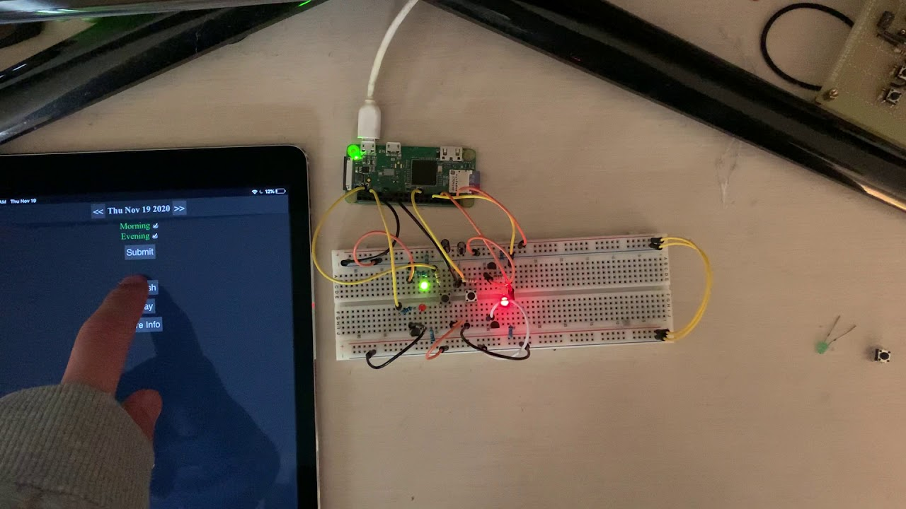
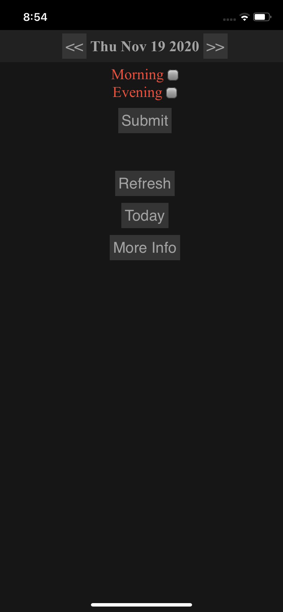
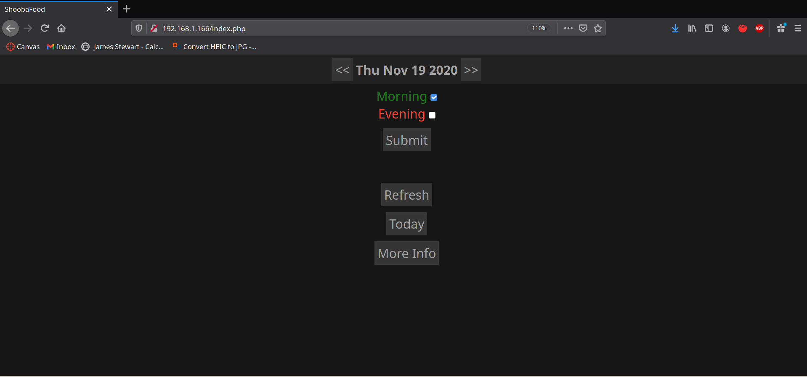

# CatFood UI
This meal tracker makes communication between family members/housemates easy through internet access and an easy to use physical interface.

## [Physical Interface Video Demo](https://youtu.be/mRvmaizEMSw)  
  

## Webpage
CatFood runs on LAMP and allows easy access from any device on the local network. The page is optimized for iOS use, and saving to the home screen on iOS devices offers an application-like experience for added simplicity.  

### Screenshots
iOS:

  

  

Firefox:
  
